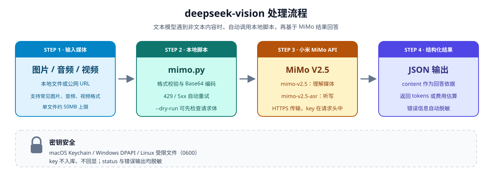
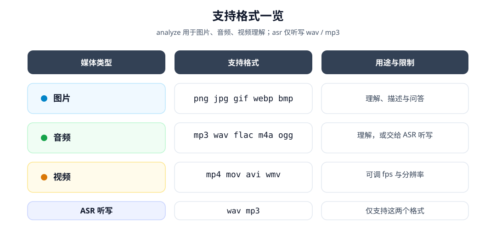

# deepseek-vision skill

将图片、音频、视频等非文本内容转交给小米 MiMo V2.5 处理，让文本模型可以可靠地“看图、听音、看视频”，并自动统计 Token Plan 用量或按量付费费用。本仓库不包含任何 API Key，使用前需先配置。

本仓库是 `deepseek-vision` skill 的公开分发仓库，skill 本体位于仓库内的 `deepseek-vision/` 目录。

## 安装到 Codex

方式一：clone 后复制到 Codex 技能目录

```bash
git clone https://github.com/reF0o0/deepseek-vision.git
cp -r deepseek-vision/deepseek-vision ~/.codex/skills/deepseek-vision
```

方式二：直接使用仓库内的 `deepseek-vision/` 目录作为 skill 根目录，并在 Codex 中配置好 skill 路径。

安装后打开或新建 Codex 对话即可使用；首次使用前配置 MiMo（以下命令在 skill 根目录执行）：

```bash
cd ~/.codex/skills/deepseek-vision
python3 scripts/mimo.py configure --plan payg            # 按量付费
python3 scripts/mimo.py configure --plan token --base-url "https://你的专属TokenPlan地址/v1"
python3 scripts/mimo.py status
```

## 使用示例

```bash
# 图片/音频/视频理解
python3 scripts/mimo.py analyze --files /path/to/file.png --prompt "描述这张图片"
python3 scripts/mimo.py analyze --files /path/to/video.mp4 --prompt "总结视频内容" --fps 1
python3 scripts/mimo.py analyze --urls https://example.com/a.mp3 --prompt "这段音频说了什么"

# 音频转文字/听写
python3 scripts/mimo.py asr --file /path/to/audio.mp3 --language auto

# 后台任务，适合长时间识别
python3 scripts/mimo.py analyze --files /path/to/file.png --prompt "描述这张图片" --async
python3 scripts/mimo.py poll --job <job_id> --wait 30
python3 scripts/mimo.py jobs
```

## 工作流程



## 支持格式



## 优点

- 能力补全：补足纯文本模型无法直接处理的媒体内容，避免瞎猜或假装看懂。
- 全局配置：key 存于 macOS Keychain / Windows DPAPI / 受限权限文件，不入库、不回显，输出会脱敏。
- 开箱即用：支持本地文件和公网 URL，覆盖常见图片、音频、视频格式，另有 ASR 听写、`--dry-run` 检查请求体、自动重试和错误提示。
- 成本可见：每次使用后返回 token 数或估算费用，便于控制开销。
- 边界清晰：纯文本请求由模型自己处理，只有遇到媒体内容才调用 MiMo。

## 风险与注意

- 隐私外发：媒体文件会以 Base64 上传到小米 MiMo API，机密或敏感内容不要直接交给它。
- 产生费用：按量付费按 token/音频时长计费，Token Plan 消耗配额；大文件、高 fps、长音频和过大 `--max-tokens` 都会推高成本。
- 外部依赖：需要网络、有效 key 和正确的 Base URL；接口或定价变动可能影响可用性与费用估算。
- 有边界限制：单文件 Base64 超过约 50MB 会失败，ASR 只支持 wav/mp3，部分 URL 需要手动指定媒体类型。
- 凭据安全：不要分享 key 或将 `MIMO_API_KEY` 写入版本库；Linux 回退到用户目录 JSON 文件，需注意文件权限。
